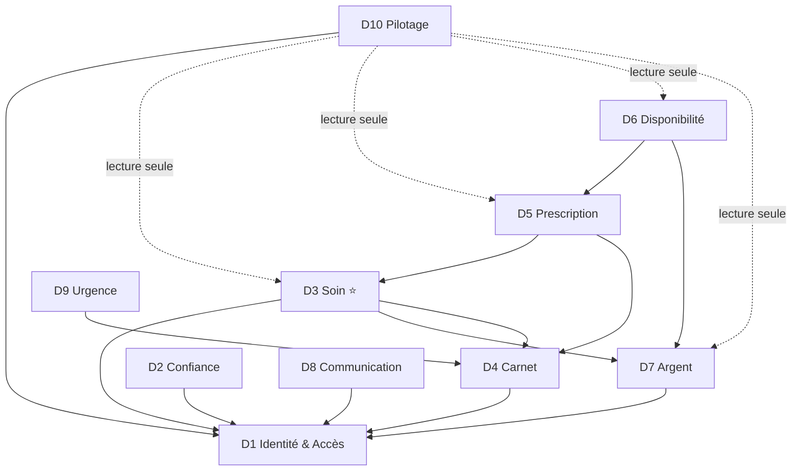

# Carte des Domaines — ULAMU

| Champ | Valeur |
|---|---|
| Version | 1.0 |
| Date | 2026-06-10 |
| Statut | 🟢 Validé (2026-06-10) |
| Documents liés | [[glossaire]] · [[vision]] |

> Découpage du système en **10 domaines fonctionnels** à forte cohésion interne et faible couplage. Chaque futur module appartient à exactement un domaine. Les flèches du schéma indiquent « a besoin de ».

---

## 1. Les 10 domaines

| # | Domaine | Mission (une phrase) | Concepts du [[glossaire]] | Acteurs principaux |
|---|---|---|---|---|
| **D1** | **Identité & Accès** | Savoir qui est qui, et qui a le droit de faire quoi. | Comptes, rôles. ~~espaces structures, Titulaire, Membre~~ (retirés — [[registre_decisions#D-051 — Trois acteurs, et deux seulement sur le web (remplace D-003 et D-004 sur le volet COMPTE)|D-051]]) | Tous |
| **D2** | **Confiance & Conformité** | Garantir que les professionnels sont vrais et que tout est tracé. | Vérification, Badge Vérifié, Contrat numérique, Signalement, journal d'audit | Professionnels, Admin Vérification |
| **D3** | **Soin** ⭐ | Orchestrer l'acte médical : de la poignée de main au compte-rendu. | Offre, Initiation, Confirmation, Poignée de main, Session, Décompteur, Pré-consultation, Prolongation, Suivi, Compte-rendu, Notation | Patient, Professionnel |
| **D4** | **Carnet** | Construire la mémoire médicale à vie du patient. | Carnet, Entrée, Constantes, Mission de triage | Patient, Professionnels, Le Système |
| **D5** | **Prescription** | Faire circuler ordonnances et examens de façon infalsifiable. | Ordonnance, Ligne, Garde-fou allergies, Délivrance, Demande d'examens, Résultats | Prescripteur, Pharmacie, Laboratoire, Patient |
| **D6** | **Disponibilité & Localisation** | Dire où se trouve ce dont le patient a besoin — et le réserver. | Stock, Recherche anonyme, Dévoilement, Réservation, guidage | Patient, Pharmacie, Laboratoire |
| **D7** | **Argent** | Encaisser, répartir, rembourser, reverser — au franc près. | Paiement, Commission, Reçu, Remboursement automatique, Gains, Retrait | Patient, Professionnels, Admin Finance |
| **D8** | **Communication** | Notifier la bonne personne, au bon moment, sur le bon canal. | notifications push/SMS, rappels de médicaments | Le Système, tous |
| **D9** | **Urgence** | Sauver des minutes quand tout va mal — jamais monétisé. | Bouton Urgence (périmètre : Q-006) | Patient, tiers |
| **D10** | **Pilotage** | Donner à chacun sa vue : tableaux de bord, administration, paramètres. | tableaux de bord, paramètres plateforme | Tous, Équipe ULAMU |

## 2. Relations entre domaines

**Règles de dépendance (anti-cycles) :**
1. **D1 (Identité) est le socle** : tout le monde peut en dépendre, lui ne dépend de personne.
2. **D8 (Communication) est un service rendu** : les domaines lui *envoient* des demandes de notification ; il ne connaît la logique de personne.
3. **D7 (Argent) ne connaît pas le métier** : il exécute des ordres de paiement/remboursement émis par D3 et D6, avec une référence opaque. C'est ainsi qu'on casse le cycle « RDV ↔ Paiements » de l'ancien cahier.
4. **D10 (Pilotage) lit, n'écrit jamais** dans les autres domaines.
5. **D9 (Urgence) lit le Carnet**, ne dépend de rien d'autre — il doit survivre même si tout le reste tombe.

## 3. Frontières sensibles (à contractualiser au [[plan_modules]])

| Frontière | Échange | Direction |
|---|---|---|
| D3 → D7 | « Encaisse X XAF pour la session S » / « Rembourse la session S » | Le Soin commande, l'Argent exécute |
| D6 → D7 | « Encaisse 500 XAF pour le dévoilement V » | idem |
| D5 → D6 | « La délivrance de l'ordonnance O décrémente le stock » | La Prescription notifie, la Disponibilité applique |
| D3 → D4 | « Voici le compte-rendu de la session S pour le Carnet du patient P » | Écriture en fin de session |
| D2 → D3/D5/D6 | « Ce professionnel est vérifié / suspendu » | La Confiance conditionne l'exercice |

---

*Phase 1 — document 2/7 · Précédent : [[glossaire]] · Suivant : [[plan_modules]] (à rédiger) · Index : [[../00_HOME|HOME]]*
