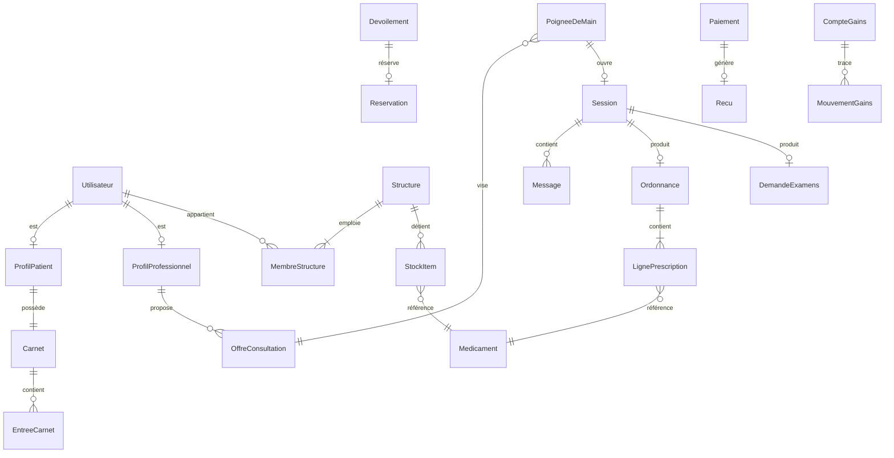

# Modèle de Données Global — ULAMU

| Champ | Valeur |
|---|---|
| Version | 1.0 |
| Date | 2026-06-10 |
| Statut | 🟢 Validé (2026-06-10) |
| Documents liés | [[plan_modules]] · [[glossaire]] |

> **Dictionnaire central.** Toute entité partagée est définie ICI une seule fois ; les modules y font référence et ne redéfinissent jamais. Niveau conceptuel (le typage fin et les index relèvent de la conception technique, Phase 3).

---

## 1. Vue d'ensemble

## 2. Dictionnaire par domaine

### D1 — Identité & Accès
| Entité | Attributs clés | Règles |
|---|---|---|
| **Utilisateur** | id, téléphone (unique, identifiant principal), e-mail (optionnel), mot de passe haché, type (patient / professionnel / admin), statut (actif, suspendu, clôturé) | Le téléphone est l'identifiant universel (réalité congolaise). |
| **ProfilPatient** | utilisateur, nom, prénom, naissance, sexe, arrondissement, contact d'urgence | 1 patient = 1 Carnet créé automatiquement. |
| **ProfilProfessionnel** | utilisateur, catégorie (généraliste, spécialiste, dentiste, sage-femme, infirmier, agent communautaire), spécialité, biographie, statut de vérification | Prescripteur = dérivé de la catégorie, jamais stocké en double. |
| **Structure** | id, type (pharmacie / laboratoire), nom, arrondissement, quartier, position GPS, horaires, statut de vérification | Position GPS jamais exposée sans Dévoilement (D-009). |
| **MembreStructure** | structure, utilisateur, rôle interne (titulaire / membre), droits | 1 seul titulaire actif par structure. ⚠️ **Plus alimentée depuis le 02/09/2026** ([[registre_decisions#D-051 — Trois acteurs, et deux seulement sur le web (remplace D-003 et D-004 sur le volet COMPTE)|D-051]]) : le compte membre de structure est retiré du produit. La table demeure — l'en retirer demanderait une migration sur la production, et le journal d'audit la nomme encore. |

### D2 — Confiance & Conformité
| Entité | Attributs clés | Règles |
|---|---|---|
| **DossierVerification** | sujet (professionnel ou structure), documents, statut (en attente, vérifié, refusé), vérificateur, dates | Aucun professionnel visible dans l'annuaire sans dossier au moins déposé (C6). |
| **ContratNumerique** | signataire, version du contrat, taux de commission, signature électronique, date | Toute modification de taux = nouvelle version signée (D-022). |
| **Signalement** | auteur, cible (profil, message, structure), motif, statut | — |
| **EvenementAudit** | acteur, action, ressource, horodatage, empreinte | Écriture seule, jamais modifié ni supprimé (C5). |

### D3 — Soin
| Entité | Attributs clés | Règles |
|---|---|---|
| **OffreConsultation** | professionnel, libellé, durée (min), prix (XAF), type (standard / suivi), active | Le prix affiché inclut la commission (D-010). |
| **PoigneeDeMain** | patient, offre, statut (initiée → confirmée → payée / expirée / refusée), horodatages de chaque étape | Confirmation expirée = retour à zéro, aucun paiement possible (D-007). |
| **Session** | poignée de main, début, fin prévue, fin réelle, statut (active, prolongée, terminée, remboursée), prolongations | Remboursée automatiquement si aucun message du professionnel (D-008). |
| **Message** | session, émetteur, type (texte, photo, vocal, document), contenu, statut (envoyé, livré, lu) | N'existe que dans une Session active. |
| **PreConsultation** | session, symptômes, durée des symptômes, pièces jointes | Lisible par le professionnel dès la poignée de main payée (D-019). |
| **Notation** | session, note (1-5), commentaire | 1 par session, par le patient uniquement (D-021). |

### D4 — Carnet
| Entité | Attributs clés | Règles |
|---|---|---|
| **Carnet** | patient, date de création | 1 par patient, gratuit à vie (D-020). |
| **EntreeCarnet** | carnet, type (compte-rendu, ordonnance, constantes, résultats, allergie, antécédent), auteur, source (référence session/mission/demande), horodatage | **Immuable** : jamais modifiée ni supprimée ; correction = nouvelle entrée. |
| **MissionTriage** | patient, soignant, statut, prix, position d'intervention, constantes produites | Produit des EntreeCarnet de type constantes (D-018). |

### D5 — Prescription
| Entité | Attributs clés | Règles |
|---|---|---|
| **Medicament** *(référentiel)* | DCI, noms commerciaux, forme, dosage | Référentiel unique, géré par l'Équipe ULAMU. |
| **Ordonnance** | session, prescripteur, patient, QR unique, signature, statut (active, partielle, délivrée, expirée, annulée), expiration | Créée uniquement en Session (D-014). Passe le Garde-fou allergies. |
| **LignePrescription** | ordonnance, médicament, posologie, durée, quantité prescrite, quantité délivrée | quantité délivrée ≤ prescrite. |
| **DemandeExamens** | session, prescripteur, patient, examens demandés, statut | — |
| **ResultatExamens** | demande, laboratoire, fichiers, date | Versé au Carnet à réception (D-015, C2). |

### D6 — Disponibilité & Localisation
| Entité | Attributs clés | Règles |
|---|---|---|
| **StockItem** | structure, médicament, lot, quantité, péremption, prix | Décrémenté par la Délivrance (C3). |
| **CatalogueExamen** | laboratoire, examen, prix, délai de résultat | — |
| **RechercheAnonyme** | patient, objet (produits / ordonnance / examen), résultats agrégés (arrondissement, nombre, quantité), date | Ne stocke jamais l'identité des structures côté patient (D-009). |
| **Devoilement** | recherche, structure révélée, référence paiement, expire à (+24 h), statut | Lié à un Paiement de 500 XAF (D-023). |
| **Reservation** | dévoilement, items réservés, statut (active, honorée, expirée) | Garantie patient : Q-004 à trancher au module M12. |

### D7 — Argent
| Entité | Attributs clés | Règles |
|---|---|---|
| **Paiement** | référence métier **opaque**, payeur, montant, opérateur (MTN / Airtel), statut (initié, réussi, échoué, remboursé), horodatages | M13 ne sait pas ce qu'est une « session » — il ne voit que des références (C1). |
| **Repartition** | paiement, part professionnel/structure, commission ULAMU | Calculée au taux du ContratNumerique en vigueur. |
| **Recu** | paiement, numéro, document | Systématique (D-010). |
| **CompteGains** | titulaire (professionnel ou structure), solde | — |
| **MouvementGains** | compte, type (crédit, retrait), montant, référence | Journal complet, jamais de mise à jour de solde sans mouvement. |
| **Retrait** | compte, montant, opérateur, statut | 0 % de commission ULAMU (D-022). |

### D8 / D9 / D10 — Communication, Urgence, Pilotage
| Entité | Attributs clés | Règles |
|---|---|---|
| **Notification** | destinataire, modèle, données, canal (push, SMS), statut | Service aveugle (C4). |
| **RappelMedicament** | patient, ligne de prescription, schéma de prise, actif | Gratuit (vision §2). |
| **FicheUrgence** | patient, données critiques (allergies, groupe sanguin, contact) | Extraite du Carnet ; périmètre Q-006. |
| **ParametrePlateforme** | clé, valeur, version, date d'effet | Miroir applicatif de [[parametres_metier]] ; historisé. |

## 3. Règles transversales d'intégrité

1. **Identité unique** : le numéro de téléphone est l'identifiant racine de tout Utilisateur.
2. **Immutabilité médicale** : EntreeCarnet et EvenementAudit ne sont jamais modifiés ni supprimés.
3. **Argent aveugle** : aucune entité de D7 ne référence directement une entité métier — uniquement des références opaques.
4. **Aucune valeur chiffrée en dur** : prix du dévoilement, taux, délais → toujours lus dans ParametrePlateforme ([[parametres_metier]]).
5. **Position GPS des structures** : donnée sensible commercialement — exposée uniquement via un Devoilement actif.

---

*Phase 1 — document 4/7 · Précédent : [[plan_modules]] · Suivant : [[parametres_metier]] (à rédiger) · Index : [[../00_HOME|HOME]]*
