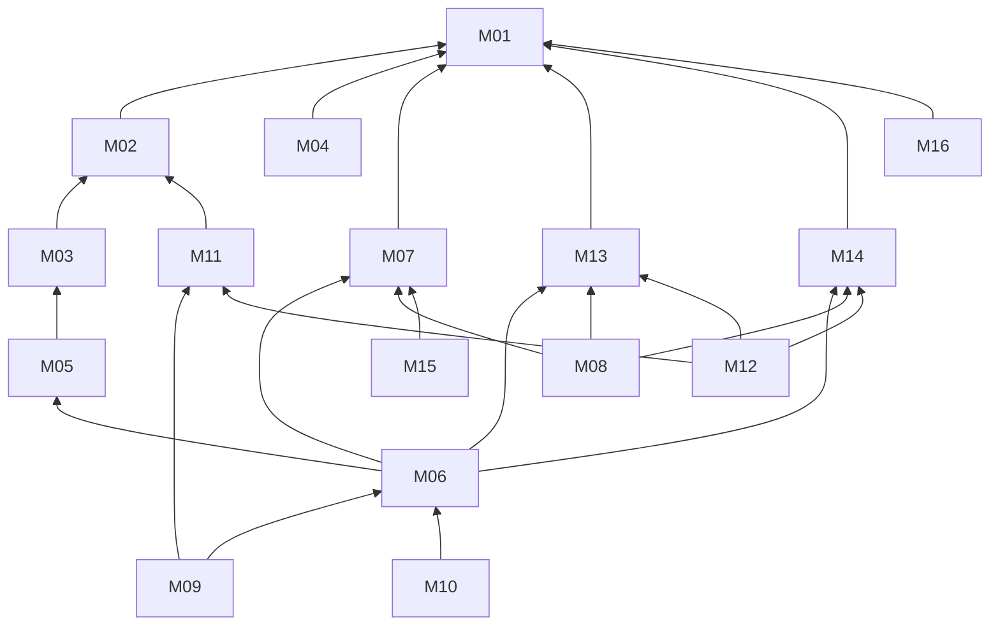

# Plan des Modules — ULAMU

| Champ | Valeur |
|---|---|
| Version | 1.0 |
| Date | 2026-06-10 |
| Statut | 🟢 Validé (2026-06-10) |
| Documents liés | [[carte_domaines]] · [[glossaire]] |

> **16 modules** (contre 25 dans l'ancien cahier), dérivés des 10 domaines. Le graphe de dépendances est **acyclique** (vérifié §3). La priorité par release sera fixée dans [[plan_releases]] — pas ici, pour éviter le piège du « tout est critique ».

---

## 1. Les 16 modules

| # | Module | Domaine | Mission |
|---|---|---|---|
| **M01** | Comptes & Authentification | D1 | Inscription, connexion, récupération d'accès, sécurité du compte. Le socle. |
| **M02** | Rôles & Espaces Structures | D1 | Permissions par rôle. ⚠️ ~~création d'un espace structure, gestion titulaire/membres~~ — **retiré du produit le 02/09/2026** ([[registre_decisions#D-051 — Trois acteurs, et deux seulement sur le web (remplace D-003 et D-004 sur le volet COMPTE)|D-051]]). |
| **M03** | Vérification & Contrats | D2 | Dossier de vérification des professionnels/structures, Badge Vérifié, signature du contrat numérique. |
| **M04** | Audit & Signalements | D2 | Journal d'audit inaltérable (reçoit les événements de tous), signalements et modération. |
| **M05** | Annuaire des Professionnels | D3 | Profils publics, offres de consultation, recherche et filtres, affichage des notations. |
| **M06** | Poignée de main & Session | D3 ⭐ | Initiation → confirmation → ordre de paiement → session chronométrée (messagerie, décompteur, pré-consultation, prolongation, compte-rendu, notation). |
| **M07** | Carnet | D4 | Le dossier médical à vie : entrées horodatées, constantes, consultation par les acteurs autorisés. |
| **M08** | Missions de Triage | D4 | Demande, attribution et paiement des missions de terrain des soignants ; constantes versées au Carnet. |
| **M09** | Ordonnance & Délivrance | D5 | Création en session, garde-fou allergies, QR, scan en pharmacie, délivrance totale/partielle. |
| **M10** | Examens & Résultats | D5 | Demande d'examens en session, téléversement des résultats par le labo dans le Carnet. |
| ~~**M11**~~ | ~~Stocks & Catalogues~~ | D6 | ❌ **RETIRÉ du produit le 02/09/2026** ([[registre_decisions#D-052 — La chaîne du médicament en pharmacie sort du produit (M11, M12, délivrance M09)|D-052]]) — hors périmètre : ULAMU couvre le patient, le médecin, l'administration. |
| ~~**M12**~~ | ~~Recherche & Dévoilement~~ | D6 | ❌ **RETIRÉ le 02/09/2026** ([[registre_decisions#D-052 — La chaîne du médicament en pharmacie sort du produit (M11, M12, délivrance M09)|D-052]]). ⚠️ Le **référentiel médicaments** (`GET /v1/medicaments`, EF-09-02) n'est pas supprimé : il passe à **M09**, sans changer d'adresse. |
| **M13** | Paiements & Gains | D7 | Encaissement MoMo (agrégateur), répartition commission, reçus, remboursements automatiques, gains, retraits. **Ne connaît pas le métier** : exécute des ordres référencés. |
| **M14** | Notifications & Rappels | D8 | Push/SMS, rappels de médicaments. Service aveugle au métier : reçoit des demandes d'envoi. |
| **M15** | Urgence | D9 | Bouton Urgence flottant (périmètre à trancher : Q-006). Ne dépend que du Carnet. |
| **M16** | Pilotage & Administration | D10 | Tableaux de bord par acteur, back-office Équipe ULAMU, paramètres de la plateforme. Lecture seule sur les autres modules. |

## 2. Graphe de dépendances (acyclique)

*Lecture : « M06 → M05 » = M06 a besoin que M05 existe. M04 (audit) et M16 (pilotage) reçoivent/lisent les événements de tous sans créer de dépendance inverse.*

**Vérification anti-cycle ✅** — ordre topologique valide :
`M01 → M02, M07, M13, M14 → M03, M04, M11 → M05 → M06 → M08, M09, M10, M12, M15 → M16`

## 3. Contrats d'interface (frontières sensibles)

| Contrat | Fournisseur → Consommateur | Contenu de l'échange |
|---|---|---|
| C1 | M13 ← M06, M08, M12 | « Encaisse X XAF, référence R » / « Rembourse la référence R » — M13 répond : payé / échoué / remboursé |
| C2 | M07 ← M06, M08, M09, M10 | « Ajoute cette Entrée au Carnet du patient P » (compte-rendu, constantes, ordonnance, résultats) |
| ~~C3~~ | ~~M11 ← M09~~ | ❌ sans objet depuis le 02/09/2026 ([[registre_decisions#D-052 — La chaîne du médicament en pharmacie sort du produit (M11, M12, délivrance M09)|D-052]]) |
| C4 | M14 ← tous | « Notifie l'utilisateur U : modèle T, données D, canal préféré » |
| C5 | M04 ← tous | Événement d'audit horodaté (acteur, action, ressource) — écriture seule |
| C6 | M03 → M05, M06 | Statut du professionnel : vérifié / non vérifié / suspendu (conditionne visibilité et exercice) |
| ~~C7~~ | ~~M12 ← M11~~ | ❌ sans objet depuis le 02/09/2026 ([[registre_decisions#D-052 — La chaîne du médicament en pharmacie sort du produit (M11, M12, délivrance M09)|D-052]]) |

## 4. Correspondance avec l'ancien cahier (traçabilité)

| Ancien (25 modules) | Nouveau |
|---|---|
| 01 Auth, 02 Rôles | M01, M02 |
| 03 i18n | ❌ Abandonné (D-005 : français uniquement) |
| 04 Offline | Devient une exigence transversale ([[exigences_non_fonctionnelles]]), pas un module |
| 05 Notifications | M14 |
| 06 Audit | M04 |
| 07-10 Profils (patient, médecin, infirmier, pharmacien) | Fondus dans M01/M02/M03/M05 (le « profil » n'est pas un module, c'est une donnée) |
| 11 Admin | M16 |
| 12 DMP, 13 Partage | M07 (le partage par QR sera traité avec M07/M15) |
| 14 RDV, 15 Messagerie, 16 Consultation | **M06** (fusionnés — c'est une seule expérience : la Session) |
| 17 Ordonnance | M09 |
| 18 Paiements, 19 Portefeuille | M13 |
| 20 Abonnements | ❌ Abandonné (nouveau modèle : commissions + dévoilements, D-022/D-023) |
| ~~21 Carte, 22 Stocks~~ | ~~M11, M12~~ — ❌ retirés ([[registre_decisions#D-052 — La chaîne du médicament en pharmacie sort du produit (M11, M12, délivrance M09)|D-052]]) |
| 23 Urgence | M15 |
| 24 Dashboards | M16 |
| 25 Épidémiologie | ❌ Reporté (vision long terme, hors périmètre actuel) |

---

*Phase 1 — document 3/7 · Précédent : [[carte_domaines]] · Suivant : [[modele_donnees_global]] (à rédiger) · Index : [[../00_HOME|HOME]]*
